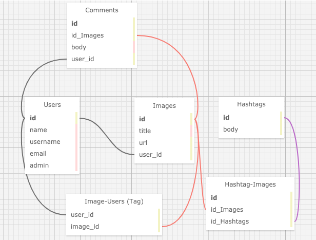

# _Flickr Clone_

_21 October 2020_

#### _Web app that imitates flickr photo sharing funcitonality_

#### By _**Vanessa Stewart**_

## Description

_This is a project for Epicodus to practice authentication. The original instructions include:_

Make an app that lets users upload their photos to share with the world. Feel free to clone Flickr exactly or make a variation for a specific audience.

Photo sharing features to include:

Users create accounts
Users can add, edit, delete images (but only their own)
Users can add, edit, delete tags for all images
Users can tag each other in images (to start simple, you may choose to display a list of all the users in a drop-down menu when you add a tag)
Users have a profile page (users#show) with a list of all the photos they are tagged in
Users can "favorite" images; include image favorites on profile page
Users can add, edit, delete comments to images

Here are the basic requirements:

Use Devise to create user authentication first. Consider creating different privileges for a user and an admin - either by creating a boolean admin property on a user or by creating separate user and admin Devise models.
Use ActiveStorage to add images.
Deploy to Heroku. (All functionality should be in place and all tests passing!)

## User Stories
| #     | Story | 
| -------- | -------- |
| 1 | As a user, I want to be able to create an account. | 
| 2 | As a user, I want to add, edit, and delete images that I upload. |  
| 3 | As a user, I want to add, edit, and delete tags for all images, not just my own. | 
| 4 | As a user, I want to have a profile page with a list of photos I am tagged in and a section with image favorites. | 
| 5 | As a user, I want to "favorite" images. | 
| 6 | As a user, I want to add, edit, and delte comments to images. |  

## Data Tables and Relationships

## Setup/Installation Requirements

1. Install Rails
- For this project, you will need Ruby. Follow the directions [here](https://www.learnhowtoprogram.com/ruby-and-rails/getting-started-with-ruby/ruby-installation-and-setup) for setting up Ruby.
- Install Rails on your machine with the following terminal command `gem install rails -v 5.2.0`

1. Clone Repo and Install Bundler
- Navigate to the directory on your local computer where you would like to clone this repo.
- Clone this repo using the `git clone` command in terminal/command line.
- Navigate to the cloned folder and run `gem install bundler` to install Bundler, which will mange all gem installations for our project.
- Run `bundle` or `bundle install` in your command line to download all dependencies. (If you add additional gems later, you will need to run `bundle update <gem name>`.)

1. Set Up Database
- Run `rake db:setup` in the terminal. This is akin to running the following rake tasks all at once: db:create(creates the dev and test databases for the current env), db:schema:load (recreates the database from the schema.rb file), and db:seed(runs the db/seed.rb file).

1. Open in Text Editor
- Open the cloned repo in a text editor of your choice.
- To Run Tests: While in the root directory of this project, run `rspec` in your command line.
- To Run the App in Browser: While in the root directory of the project, run `rails s` in the terminal. This will start a server, which you can access by entering `localhost:3000` in your browser.

## Known Bugs

_There are no known bugs at this time._

## Technologies Used

* HTML
* CSS/Bootstrap
* Ruby
* Rails

### License

Copyright (c) 2020 **_Vanessa Stewart_**

Permission is hereby granted, free of charge, to any person obtaining a copy of this software and associated documentation files (the "Software"), to deal in the Software without restriction, including without limitation the rights to use, copy, modify, merge, publish, distribute, sublicense, and/or sell copies of the Software, and to permit persons to whom the Software is furnished to do so, subject to the following conditions:

The above copyright notice and this permission notice shall be included in all copies or substantial portions of the Software.

THE SOFTWARE IS PROVIDED "AS IS", WITHOUT WARRANTY OF ANY KIND, EXPRESS OR IMPLIED, INCLUDING BUT NOT LIMITED TO THE WARRANTIES OF MERCHANTABILITY, FITNESS FOR A PARTICULAR PURPOSE AND NONINFRINGEMENT. IN NO EVENT SHALL THE AUTHORS OR COPYRIGHT HOLDERS BE LIABLE FOR ANY CLAIM, DAMAGES OR OTHER LIABILITY, WHETHER IN AN ACTION OF CONTRACT, TORT OR OTHERWISE, ARISING FROM, OUT OF OR IN CONNECTION WITH THE SOFTWARE OR THE USE OR OTHER DEALINGS IN THE SOFTWARE.
